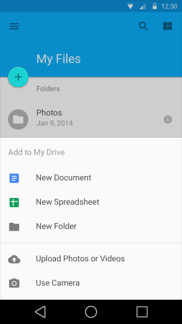
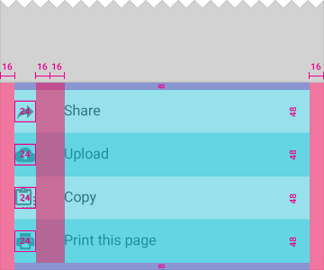
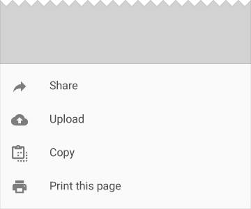
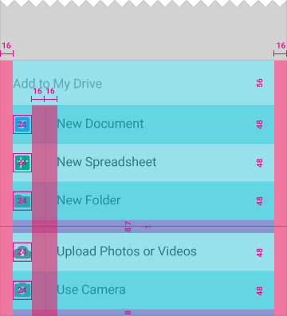
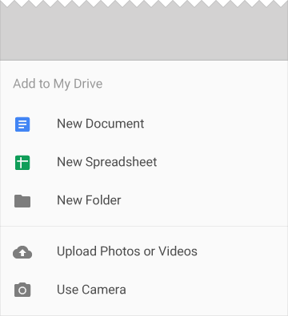
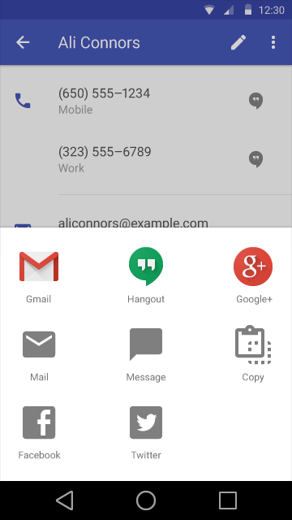
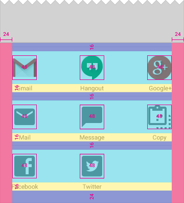
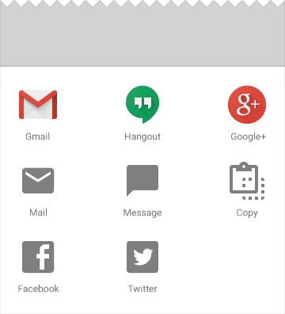

## 底部动作条(Bottom Sheets)

底部动作条(Bottom Sheets)是一个从屏幕底部边缘向上滑出的一个面板，使用这种方式向用户呈现一组功能。底部动作条呈现了简单、清晰、无需额外解释的一组操作。

## 使用

底部动作条(Bottom Sheets)特别适合有三个或者三个以上的操作需要提供给用户选择、并且不需要对操作有额外解释的情景。如果只有两个或者更少的操作，或者需要详加描述的，可以考虑使用菜单(Menu)或者对话框替代。

底部动作条(Bottom Sheets)可以是列表样式的也可以是宫格样式的。宫格布局可以增加视觉的清晰度。

你可以使用底部动作条(Bottom Sheets)展示和其他app相关的操作，比如做为进入其他app的入口(通过app的icon进入)。

## 内容

在一个标准的列表样式的底部动作条(Bottom Sheets)中，每一个操作应该有一句描述和一个左对齐的icon。如果需要的话，也可以使用分隔符对这些操作进行逻辑分组，也可以为分组添加标题或者副标题。

一个可以滚动的宫格样式的底部动作条，可以用来包含标准的分享操作。

## 行为

显示底部动作条的时候，动画应该从屏幕底部边缘向上展开。根据上一步的内容，向用户展示用户上一步的操作之后能够继续操作的内容，并提供模态[1]的选择。点击其他区域会使得底部动作条伴随下滑的动画关闭掉。如果这个窗口包含的操作超出了默认的显示区域，这个窗口需要可以滑动。滑动操作应当向上拉起这个动作条的内容，甚至可以覆盖整个屏幕。当窗口覆盖整个屏幕的时候，需要在上部的标题栏左侧增加一个收起按钮。

## 规格

下面的字体、颜色和区域规格都是提供给手机app使用的。

(上图)列表样式的底部动作条规格设计

(上图)带头部的列表样式的底部动作条规格设计

(上图)包含跳转到其他程序入口的标准宫格样式的底部动作条规格设计

[1]模态：模态的对话框需要用户必须选择一项操作后才会消失，比如Alert确认等；而非模态的对话框并不需要用户必须选择一项操作才会消失，比如页面上弹出的Toast提示。

> 原文：[Bottom Sheets](http://www.google.com/design/spec/components/bottom-sheets.html) 翻译：[com360](https://github.com/com360) 校对：[阿九(Siton)](https://github.com/siton) 
