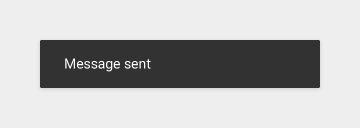
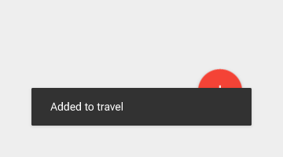
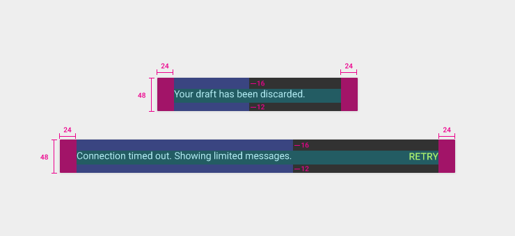

# Snackbars 与 Toasts

Snackbar 是一种针对操作的轻量级反馈机制，常以一个小的弹出框的形式，出现在手机屏幕下方或者桌面左下方。它们出现在屏幕所有层的最上方，包括浮动操作按钮。

它们会在超时或者用户在屏幕其他地方触摸之后自动消失。Snackbar 可以在屏幕上滑动关闭。当它们出现时，不会阻碍用户在屏幕上的输入，并且也不支持输入。屏幕上同时最多只能现实一个 Snackbar。

Android 也提供了一种主要用于提示系统消息的胶囊状的提示框 Toast。Toast 同 Snackbar 非常相似，但是 Toast 并不包含操作也不能从屏幕上滑动关闭。

## 用法

### 短文本

通常 Snackbar 的高度应该仅仅用于容纳所有的文本，而文本应该与执行的操作相关。Snackbar 中不能包含图标，操作只能以文本的形式存在。

  
要

  
不要

### 暂时性

为了保证可用性，Snackbar 不应该成为通往核心操作的唯一方式。作为在所有层的上方，Snackbar 不应该持续存在或相互堆叠。

  
要

  
不要

### 最多0-1个操作，不包含取消按钮

当一个动作发生的时候，应当符合提示框和可用性规则。当有2个或者2个以上的操作出现时，应该使用提示框而不是 Snackbar，即使其中的一个是取消操作。如果 Snackbar 中提示的操作重要到需要打断屏幕上正在进行的操作，那么理当使用提示框而非 Snackbar。

  
要

  
不要

### 不要阻挡了浮动操作按钮

垂直移动浮动操作按钮到 Snackbar 的上方。

  
要

  
不要

## 规格

### 手机端 Snackbar

- 单行 Snackbar 高度：48 dp
- 多行 Snackbar 高度：80 dp
- 文本：Roboto Regular 14 sp
- 操作按钮：Roboto Medium 14 sp, 大写文本
- 默认背景填充色：#323232 100%

<video crossorigin="anonymous" loop controls>
<source src="http://materialdesign.qiniudn.com/videos/components-snackbars-and-toasts-specs-snackbar.single.line-dismissal_large_xhdpi.webm" type="video/webm">
</video>

### 平板/桌面端 Snackbar

- 单行 snackbar 高度：48 dp 以上
- 最小宽度：288 dp
- 最大宽度：568 dp
- 2 dp 圆角
- 文本：Roboto Regular 14 sp
- 操作按钮：Roboto Medium 14 sp, 大写文本
- 默认背景填充色：#323232 100%

<video crossorigin="anonymous" loop controls>
<source src="http://materialdesign.qiniudn.com/videos/components-snackbars-and-toasts-specs-snackbar.tablet-time.out_large_xhdpi.webm" type="video/webm">
</video>

### Android toast

开发者可以自定义的 Toast 和它在屏幕上的位置。如果你打算自定义 Toast 的话，强烈建议按照上述 Snackbar 的样式来设计。

> 原文：[Snackbars and Toasts](http://www.google.com/design/spec/components/snackbars-and-toasts.html)  翻译：[chenzimu7](https://github.com/chenzimu7)  校对：[PoppinLp](https://github.com/poppinlp)
